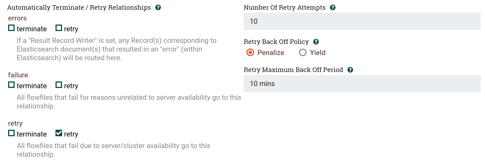

<!-- paginate: true -->

# Extra Lab: NiFi Error Handling

---

# Exercise: Dead Letter Queue

A dead letter queue (DLQ) temporarily stores files to disk that could not be processed by a data pipeline.

To configure one for NiFi, add a new PutFile processor to store failed events.

Double click the `PutFile` processor and set the following property:
- Directory: `/opt/nifi/nifi-current/state/dlq`

---

# Exercise: Dead Letter Queue (2)

Now, you need to configure your existing processors to send error events to the dead letter queue.

Hover over a `ConsumeKafkaRecord_2_6` (doesn't matter which one), then drag its arrow to the `PutFile` processor, and specify the `parse.failure` relationship for the connection.

Repeat for all other ConsumeKafkaRecord_2_6 processors.

---

# Exercise: Dead Letter Queue (3)

Now, hover over a `PutElasticsearchRecord` (doesn't matter which one), then drag its arrow to the PutFile processor, and select all the failure relationships (`failure`, `errors`, and `retry`) for the connection.

This will create a connection that will redirect all events that the `PutElasticsearchRecord` processor could not handle for one reason or another to the `PutFile` processor. The `PutFile` processor writes these events to disk, creating a DLQ.

Repeat this for all other PutElasticsearchRecord processors. 

> Note: For testing, having all the events go into a single Dead Letter Queue may be sufficient, but in production creating multiple DLQs can help simplify issue triage.

---

# Background: Retrying Processing

For some relationships, it can make sense to retry instead of sending to the DLQ right away. For example the `PutElasticsearchRecord` has a `retry` relationship for all events that could not be indexed due to the database being too busy. It makes sense that waiting a while and trying again later could allow the event to be successfully indexed.

On the other hand, the `failure` and `errors` relationships in `PutElasticsearchRecord` should not be retried. These are events that could not be indexed due to a schema conflict, a malformed record, or other error condition that cannot be rectified automatically. These should directly be sent to the DLQ.

---

# Exercise: Retry Configuration

Double click the `PutElasticsearchRecord`, navigate to the relationships tab, and select the "retry" option for the `retry` relationship. Leave the retry algorithm as-is, and press apply.

This will automatically configure 10 retries with exponential backoff. After 10 retries, the event will be sent to the DLQ if not indexed successfully.

Repeat for all other `PutElasticsearchRecord` processors.

---

# Next Steps

**Congratulations!**
You have successfully completed the following:
- Learned how to handle failure relationships
- Deployed a Dead Letter Queue
- Configured retry for a processor

**What's Next?**
You can go back to the main session [here](https://hautonjt.github.io/pipeline2.pdf#page=29).