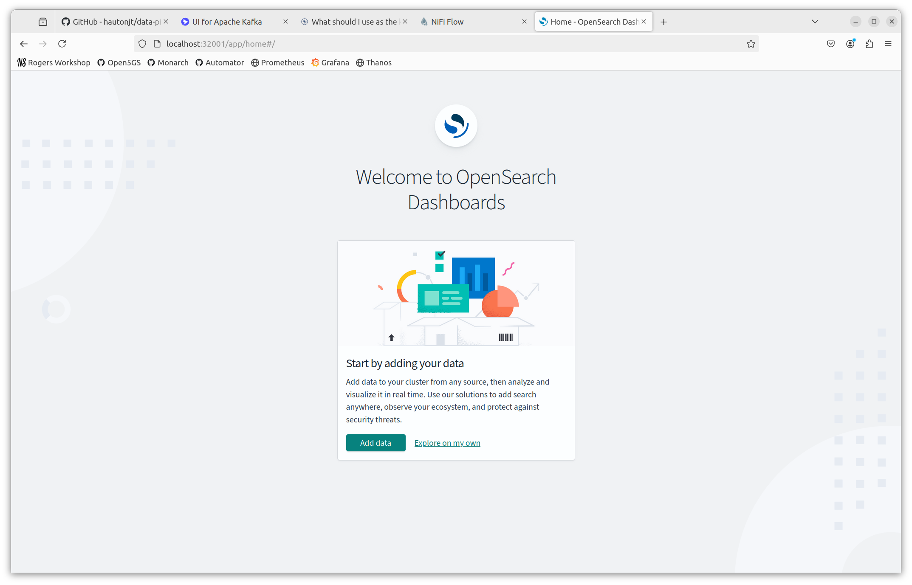
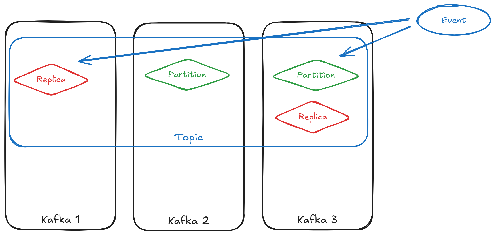
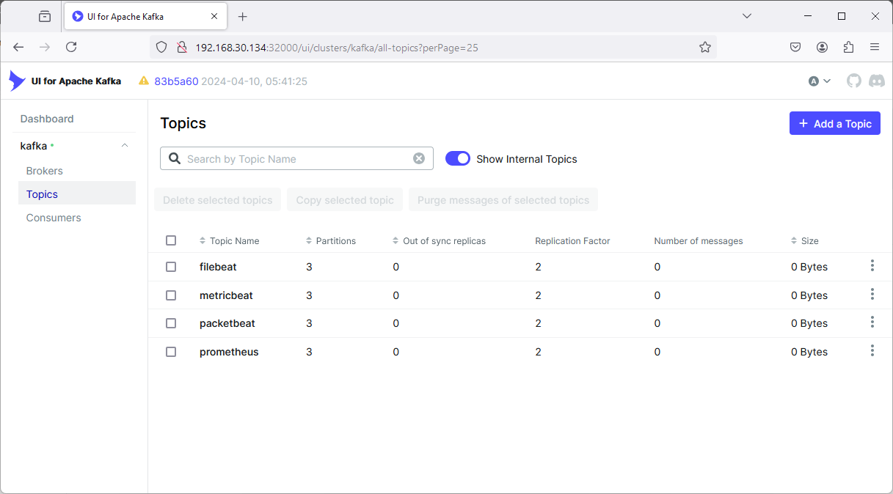
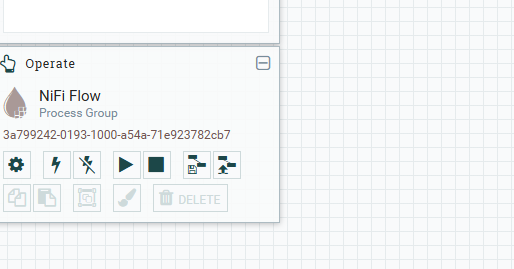
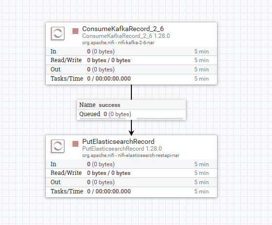
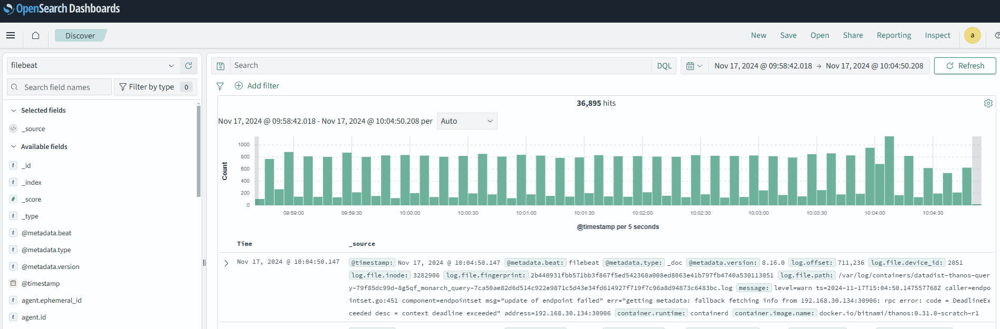

<!-- paginate: true -->


# Learning about data pipelines

This session will be all about the components of data pipelines. Specifically, we will be using the following components for our pipeline today:
  - Extractor: Filebeat, Metricbeat, and Packetbeat
  - Buffer: Apache Kafka
  - Transformer/Loader: Apache NiFi
  - Database: OpenSearch

However, to demonstrate the pipeline working, we need an environment to gather data from. So, we will be redeploying the 5G core network and MonArch monitoring system from yesterday.

---

# Redeploying the 5G Core

<style>
blockquote {
    font-size: 60%;
    margin-top: auto;
}
</style>

To begin, we will use `git clone` to fetch the source code of our data pipeline.
```
cd ~
git clone https://github.com/hautonjt/data-pipeline
cd data-pipeline
```
Now we will run `day1.sh`, which will re-create the entire Kubernetes setup we had deployed yesterday. 

We will be extracting logs from every Kubernetes container using Filebeat, memory and CPU usage of the containers and hosts using Metricbeat, and network connection information using Packetbeat. We will also demonstrate how to extend Metricbeat to extract metrics from the Prometheus exporters in MonArch as well.

> Est: 5 mins

---

# How do we create a data pipeline? (1/2)

Generally, in production we want to deploy a data pipeline in the following order:
  1. Database
  2. Buffer
  3. Transformer/Loader
  4. Extractors

The database and buffer are deployed first as they only receive events and do not send them. Once both the database and buffer have been set up, connecting them with a transformer/loader is trivial. Extractors are started last to prevent a build-up of events at the buffer while waiting for the transformer/loader to initialize.

---

# How do we create a data pipeline? (2/2)

However, for testing, it is easier to deploy the pipeline like this:
  1. Database
  2. Buffer
  3. Extractors
  4. Transformers/Loaders

By deploying the pipeline in this order, the extractors will send a bunch of events into the buffer first, which will allow you to inspect the structure of each event. This makes it much easier to check the events' schema as well as verify whether the information needed by the transformer is available. This will be the order that we will be deploying the pipeline today.

---

# Deploying the database
Let's first deploy the OpenSearch cluster. Ensure you are in the `data-pipeline` directory, then run:
```
./deploy-opensearch.sh
```
This script does the following:
  - Create a highly available OpenSearch cluster of 3 pods
  - Provision an instance of OpenSearch dashboards
  - Configure certificate-based authentication

If you check the contents of the script, you will also see the command `sudo sysctl -w vm.max_map_count=786432`. OpenSearch requires a lot of memory-mapped files for optimal performance, and this command increases the maximum number of mapped files permitted by the operating system.

---

# Switching namespaces

Both OpenSearch and OpenSearch dashboards should be deployed in a new namespace named `datapipeline`. This namespace is where all our new pipeline containers will be deployed to. 

Since we will be interacting with the `datapipeline` namespace the most in this lab, we can switch the namespace that `kubectl` is connected to by running:
```
kubectl config set-context --current --namespace=datapipeline
```
Now, if you run a kubectl command, such as,  `kubectl get pods`, it will run that command in the context of the `datapipeline` namespace by default.

---

# Access OpenSearch dashboards (2/2)

To access the dashboards, navigate to https://localhost:32001. Both the username and password to log in are set to the value `admin`. If you reach the screen below, then OpenSearch has been deployed successfully. We will return to OpenSearch dashboards later on.
<style>
img[alt~="center"] {
  display: block;
  margin: 0 auto;
}
</style>


---

# Deploy Kafka

Now that OpenSearch is configured, we can install Apache Kafka. To deploy Kafka, ensure you are in the `data-pipeline` directory, and run:

```
./deploy-kafka.sh
```

This deploys both a Kafka cluster and Kafka-UI, which can be used to configure Kafka using a GUI. 

---

# What is Kafka? (1)

Kafka is a distributed event store. Events in Kafka are mainly divided into *topics*, which are essentially categories of events. Topics are divided into partitions. These partitions allow events in a topic to be distributed across different instances of Kafka, and replicated partitions can provide fault-tolerance.



---

# What is Kafka? (2)

Topics can be configured to have any number of partitions. The higher number of partitions, the more distributed your data becomes, at the cost of some overhead. Data redundancy and availability is configured using the replication factor, and the number of in-sync replicas. 

### Replication factor
Replication factor controls the number of copies of each partition. Having a replication factor of 1 means only 1 copy of each partition, meaning no redundancy. Higher replication factors mean that data from a partition can still be available as long as one copy is still present.

---

# What is Kafka? (3)


### Min in-sync replicas
Each event must be present in at least *min in-sync replicas* before being successfully written. This minimizes the probability of data loss, but also means that if there are fewer than that many replicas of a partition are present, a partition could no longer be written to. 

---

# Configuring Kafka (1)

**1. Accessing Kafka-UI**
Once the deployment is done, the UI is accessible at http://localhost:32000.
**2. Create filebeat topic**
On the left sidebar, click *Topics*, then on the top right, select "Add a Topic". Fill out the following settings:
  - Topic Name: filebeat
  - Number of partitions: 3
  - Min in-sync replicas: 2
  - Replication factor: 2
  - Time to retain data: 1 day (select the "1 day" box below the input)

Then select "Create".

---

# Configuring Kafka (2)

**3. Exercise**

Repeat the prior steps with the topics "metricbeat", "packetbeat", and "prometheus". All other settings should remain the same. Your final screen topics screen should look something like this:



Hint: Click on the "Topics" button in the sidebar again after creating a topic to go back.

---

# Beats (1)

Now we deploy Filebeat, Metricbeat, and Packetbeat all at once. To do this, run:
```
./deploy-beats.sh
```

Filebeat, Metricbeat, and Packetbeat all produce events from different types of information. 

**Filebeat** reads informations mainly from log files and JSON HTTP endpoints. Filebeat has native integration with Kubernetes, enabling it to read the logs of all running containers, even ones deployed after Filebeat. For advanced use cases, Filebeat can also use Kubernetes annotations to separately parse the logs of certain containers if necessary.

---

# Beats (2)

**Metricbeat** reads metrics, typically resource usage, from the system. It also has native integrations with various metrics providers. Notably, this includes Prometheus, allowing us to integrate with MonArch. It also integrates with kube-state-metrics, which provide metrics on the entire Kubernetes cluster. Hence, we also deploy this in the `deploy-beats.sh` script.

**Packetbeat** captures connection information from all network interfaces present in the current running machine. This includes ingress traffic, egress traffic, and network traffic traffic between pods.

Beats are designed to be deployed together, and have a unified schema. Thus, one advantage of using Beats is not having to worry about normalizing the schema in the transformer.

---

# NiFi

Finally, we are deploying NiFi. Before deploying, To do this, run:
```
./deploy-nifi.sh
```
Note: you will need to run this with **sudo**, as we are copying the geoip database to a system directory.

This script does the following:
- deploys a NiFi cluster of 3 nodes
- deploys a Zookeeper cluster of 3 nodes (used by NiFi for maintaining configuration and cluster information)

Once NiFi is ready, you should be able to access it by going to http://localhost:32002/nifi.

---

# What is NiFi?

NiFi is a versatile distributed data processor. NiFi allows you to create data processing graphs that can allow you to visually see how data will be processed. 

# How does it work?
NiFi operates using the concept of FlowFiles, which is just a container that can hold any data along with some attributes, which are essentially metadata. This means that FlowFiles inherently do not have any structure at all.

Processors act on FlowFiles and transforms them in some way. There are a vast array of processors that cater to almost any use case, and for use cases that built-in processors are incapable of handling, NiFi also supports calling external scripts as well. 

---

# What is NiFi? (2)

Since FlowFiles have no structure, typically services need to be specified so the processor knows how to parse the FlowFile and what format to output it in. For example, the `JSONTreeReader` service reads the FlowFile and parses it into one or more JSON object for processing. The `JSONRecordSetWriter` writes an array of JSON objects as its output.

Services are not limited to just parsing FlowFiles, they also provide services such as SSL authentication, OpenSearch integration, caching, lookups, and more.

---

# Configuring NiFi

Now that NiFi has been deployed, we will need to start configuring it to consume events from Kafka and send them to OpenSearch.

Before we begin, we need to define the services our processors will need. To do this, find the Cog underneat the "NiFi Flow" text on the middle-left side of the screen. Selecting this should pop up the NiFi Flow Configuration screen. Then, select the "Controller Services" tab.



---

# Configuring NiFi (2)

After that, press the "+" symbol near the top-right side of the table to add a service. We will need to add the following services:
  - JsonTreeReader
  - JsonRecordSetWriter
  - StandardRestrictedSSLContextService
  - ElasticSearchClientServiceImpl

The JsonTreeReader and JsonRecordSetWriter can both be enabled immediately by clicking on the lightning bolts to the right of their respective rows and selecting "Enable".

---

# Configuring NiFi (3)

StandardRestrictedSSLContextService needs to be configured by clicking the Settings button on its row, then going to the Properties tab. Fill in the following properties:
  - Keystore Filename: keytool/keystore.p12
  - Keystore Password: keystore
  - Key Password: (leave blank)
  - Keystore Type: PCKS12
  - Truststore Filename: keytool/truststore.p12
  - Truststore Password: truststore
  - Truststore Type: PCKS12

Then select apply.

---

# Configuring NiFi (4)

Next, we need to configure ElasticSearchClientServiceImpl. Click on the settings button to the right, and nagivate to Properties. Enter the following settings:
- HTTP Hosts: https://opensearch-cluster-master:9200
- Username: admin
- Password: admin
- SSL Context Service: StandardRestrictedSSLContextService

Click apply, then enable both the StandardRestrictedSSLContextService and the ElasticSearchClientServiceImpl. Exit out of the NiFi Flow Configuration screen.

---

# Configuring NiFi (5)

In the top left of the screen, find the Processors icon. Click and drag the icon to create a new processor. Find the "ConsumeKafkaRecord_2_6" processor and add it.

Double click on the processor to open its settings, then set the following properties:
- Kafka Brokers: kafka:9092
- Topic Name(s): filebeat
- Value Record Reader: JsonTreeReader
- Record Value Writer: JsonRecordSetWriter
- Group ID: nifi
- Security Protocol: SASL_PLAINTEXT
- SASL Mechanism: PLAIN
- Username: user1
- Password: kafka

---

# Configuring NiFi (6)

Create a PutElasticsearchRecord processor, and configure the following settings:
- Index: filebeat
- Client Service: ElasticSearchClientServiceImpl
- Record Reader: JsonTreeReader

Click apply. Now, hover over the ConsumeKafkaRecord_2_6 processor until an arrow appears in the middle of it. Drag the arrow to the PutElasticsearchRecord processor. Select the "success" relationship, and apply.

Open the ConsumeKafkaRecord_2_6 settings again. Go to the "Relationships" tab, and select "terminate" under `parse.failure`, and apply.

Open the PutElasticsearchRecord processor settings, go to the "Relationships" tab, and select "terminate" for all relationships.

---

# Configuring NiFi (7)
The screen should now look like this:


Now, for each processor, click on it once, and in the "Operate" panel on the left, click the play button to run the processor.

---

# Configuring NiFi (8)
The screen should now look like this:


Now, for each processor, click on it once, and in the "Operate" panel on the left, click the play button to run the processor.

---

# Configuring NiFi (9)

Now, for each processor, right click on it and select "Copy". Then right click on any blank space and select "Paste" to paste a copy of the processor with identical configuration.

### Exercise

Configure the processors for the *metricbeat*, *packetbeat*, and *prometheus* topics.

Ensure that both the Topic Name in the ConsumeKafkaRecord_2_6 processor and the Index in the PutElasticsearchRecord processor are set correctly. **For Prometheus, use the Index prometheus-metricbeat.**

---

# Inspecting FlowFiles

NiFi lets you inspect queued FlowFiles pretty easily. To do this, first stop the PutElasticsearchRecord processor. Then, right click the queue (i.e., the box labeled "success"). Then select "List queue". This shows a list of all FlowFiles in the queue. 

You can select the "eye" icon to view its content. (If you get an error, ensure you stopped the PutElasticsearchRecord processor that was downstream from the queue).

In the "View as" selection box, select "formatted" to see the formatted JSON.

---

# Exercise 1 - Enrichment

Define a GeoEnrichIPRecord processor to enrich the destination IP of events from Packetbeat.

Hint: the Maxmind database is located at /opt/nifi/nifi-current/state/GeoLite2-City.mmdb

You will need to redo the relationships between the events.

Set the city record path to be `/dest

---

# Exercise 2 - Dead Letter Queue

Define PutFile processors to place failed FlowFiles into in order to create a Dead Letter Queue.

Define one for `parse.failure` in ConsumeKafkaRecord_2_6, and `failure` in PutElasticsearchRecord.

Set the directory to be a subdirectory of `/opt/nifi/nifi-current/state/`.

---

# Exercise 3 - Prometheus Metrics

In the `beats` folder in `data-pipeline`, you should be able to find a folder called `metricbeat-prometheus.yaml`.

Find the section that looks like this:
```
    metricbeat.modules:
      - module: prometheus
        period: 5s
        hosts: ["nssdc-kube-state-metrics.monarch.svc:8080"]
        metricsets: ["collector"]
        metrics_path: /metrics

      - module: prometheus
        period: 5s
        hosts: ["kpi-calculator-service.monarch.svc:9000"]
        metricsets: ["collector"]
        metrics_path: /metrics
```

---

# Exercise 3 - Prometheus Metrics (2)

These are the endpoints for Prometheus collectors. We want to add the metrics from MonArch as well. 

Go to http://localhost:30095/targets?search=, and find the endpoints. Two of them have already been configured. Add the remaining endpoints on that page in the same format, then redeploy beats by running `./deploy-beats.sh`.

---

# Dashboard

Now that everything is deployed, we can now visualize it in OpenSearch. Go to http://localhost:32001. Log in using username `admin` and password `admin` if prompted. 

Select "Explore on my own". Select the menu button on the top left, scroll down and select "Dashboards Management". Create index patterns with the names "filebeat", "packetbeat", "metricbeat", "prometheus-metricbeat", and "*beat".

Select the menu, and click on "Discover". You should see a realtime view of all your raw data.

---

# Dashboard (2)

It should look like this:



---

# Exercise 4 - Visualization

Create a visualization to view data. To do this, select the menu button, and select Visualize.

Create a new "Line" visualization, and choose the "prometheus-metricbeat" index pattern.

Set the metric as count, and use a date histogram.

Create some more visualizations by experimenting with other metrics!