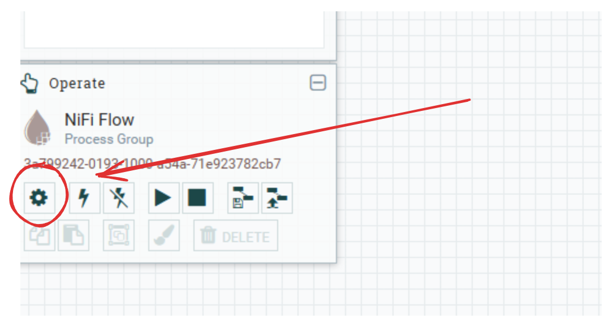
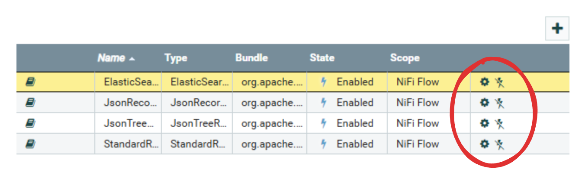
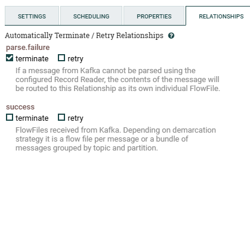
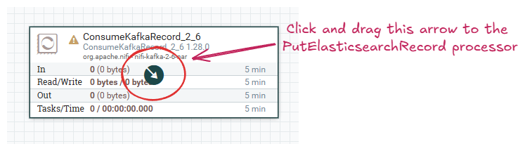
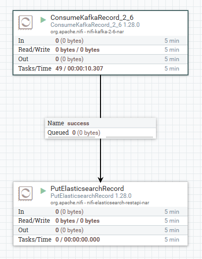
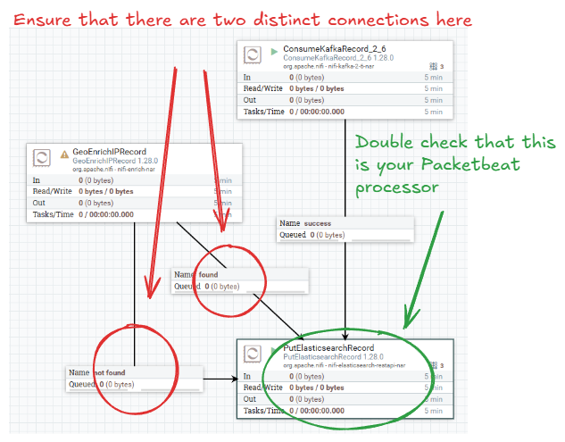
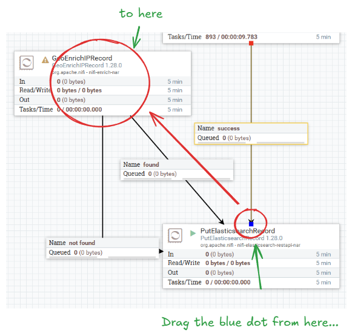
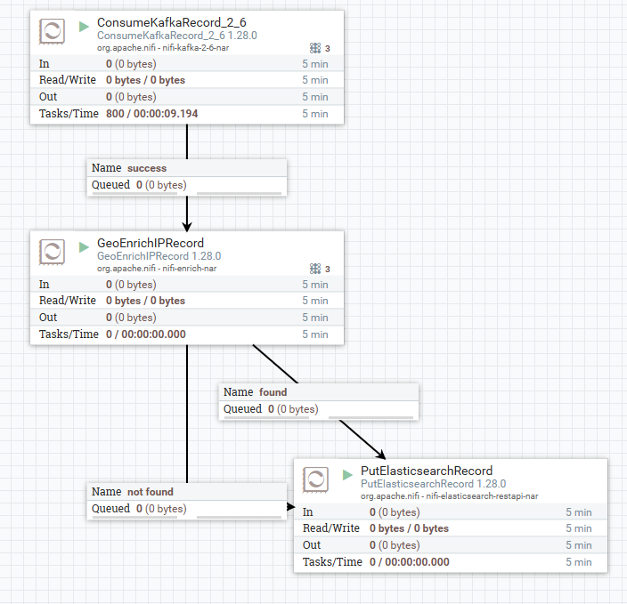

<!-- paginate: true -->

# Part 1 - Deployment

---

# Learning about data pipelines

This session will be all about the components of data pipelines. Specifically, we will be using the following components for our pipeline today:
  - Extractor: Filebeat, Metricbeat, and Packetbeat
  - Buffer: Apache Kafka
  - Transformer/Loader: Apache NiFi
  - Database: OpenSearch

However, to demonstrate the pipeline working, we need an environment to gather data from. So, we will be re-deploying the 5G core network and MonArch monitoring system from yesterday.

---

# Re-deploying the 5G Core

<style>
blockquote {
    font-size: 60%;
    margin-top: auto;
}
</style>

To begin, we will use `git clone` to fetch the source code of our data pipeline and re-create the entire Kubernetes setup we had deployed yesterday. 
```
cd ~
git clone https://github.com/hautonjt/data-pipeline
cd data-pipeline
./day1.sh
```

We will be extracting logs from every Kubernetes container using Filebeat, memory and CPU usage of the containers and hosts using Metricbeat, and network connection information using Packetbeat. We will also demonstrate how to extend Metricbeat to extract metrics from the Prometheus exporters in Monarch as well.

---

# How do we create a data pipeline?

Generally, in production we want to deploy a data pipeline in the following order:
  1. Database
  2. Buffer
  3. Transformer/Loader
  4. Extractors

The database and buffer are deployed first as they only receive events and do not send them. Once both the database and buffer have been set up, connecting them with a transformer/loader is trivial. Extractors are started last to prevent a build-up of events at the buffer while waiting for the transformer/loader to initialize.

---

# How do we create a data pipeline? (2)

However, for testing, it is easier to deploy the pipeline like this:
  1. Database
  2. Buffer
  3. Extractors
  4. Transformers/Loaders

By deploying the pipeline in this order, the extractors will send a bunch of events into the buffer first, which will allow you to inspect the structure of each event. This makes it much easier to check the events' schema as well as verify whether the information needed by the transformer is available. This will be the order that we will be deploying the pipeline today.

---

# Deploying the database
Let's first deploy the OpenSearch cluster. Ensure you are in the `data-pipeline` directory, then run:
```
./deploy-opensearch.sh
```
> Note: you will need to type your password (`user`) for this script as it uses `sudo` internally

This script does the following:
  - Create a highly available OpenSearch cluster of 3 pods
  - Provision an instance of OpenSearch dashboards
  - Configure certificate-based authentication

If you check the contents of the script, you will also see the command `sudo sysctl -w vm.max_map_count=786432`. OpenSearch requires a lot of memory-mapped files for optimal performance, and this command increases the maximum number of mapped files permitted by the operating system.

---

# Switching namespaces

Both OpenSearch and OpenSearch dashboards should be deployed in a new namespace named `datapipeline`. This namespace is where all our new pipeline containers will be deployed to. 

Since we will be interacting with the `datapipeline` namespace the most in this lab, we can switch the namespace that `kubectl` is connected to by running:
```
kubectl config set-context --current --namespace=datapipeline
```
Now, if you run a kubectl command, such as,  `kubectl get pods`, it will run that command in the context of the `datapipeline` namespace by default.

---

# Access OpenSearch dashboards

To access the dashboards, navigate to http://localhost:32001. Both the username and password to log in are set to the value `admin`. If you reach the screen below, then OpenSearch has been deployed successfully. We will return to OpenSearch dashboards later on.
<style>
img[alt~="center"] {
  display: block;
  margin: 0 auto;
}
</style>


---

# Deploy Kafka

Now that OpenSearch is configured, we can install Apache Kafka. To deploy Kafka, ensure you are in the `data-pipeline` directory, and run:

```
./deploy-kafka.sh
```

This deploys both a Kafka cluster and Kafka-UI, which can be used to configure Kafka using a GUI. 

---

# What is Kafka?

Kafka is a distributed event store. Events in Kafka are mainly divided into *topics*, which are essentially categories of events. Topics are divided into partitions. These partitions allow events in a topic to be distributed across different instances of Kafka, and replicated partitions can provide fault-tolerance.


---

# What is Kafka? (2)

Topics can be configured to have any number of partitions. The higher number of partitions, the more distributed your data becomes, at the cost of some overhead. Data redundancy and availability is configured using the replication factor, and the number of in-sync replicas. 

### Replication factor
Replication factor controls the number of copies of each partition. Having a replication factor of 1 means only 1 copy of each partition, meaning no redundancy. Higher replication factors mean that data from a partition can still be available as long as one copy is still present.

---

# What is Kafka? (3)


### Min in-sync replicas
Each event must be present in at least *min in-sync replicas* before being successfully written. This minimizes the probability of data loss, but also means that if there are fewer than that many replicas of a partition are present, a partition could no longer be written to. 

---

# Configuring Kafka

**1. Accessing Kafka-UI**
Once the deployment is done, the UI is accessible at http://localhost:32000.
**2. Create filebeat topic**
On the left sidebar, click *Topics*, then on the top right, select "Add a Topic". Fill out the following settings:
  - Topic Name: filebeat
  - Number of partitions: 3
  - Min in-sync replicas: 2
  - Replication factor: 2
  - Time to retain data: 1 day (select the "1 day" box below the input)

Then select "Create".

---

# Configuring Kafka (2)

**3. Mini-Exercise**

Repeat the prior steps with the topics "metricbeat", "packetbeat", and "prometheus". All other settings should remain the same. Your final screen topics screen should look something like this:


Hint: Click on the "Topics" button in the sidebar again after creating a topic to go back.

---

# Beats

Now we deploy Filebeat, Metricbeat, and Packetbeat all at once. To do this, run:
```
./deploy-beats.sh
```

Filebeat, Metricbeat, and Packetbeat all produce events from different types of information. 

**Filebeat** reads informations mainly from log files and JSON HTTP endpoints. Filebeat has native integration with Kubernetes, enabling it to read the logs of all running containers, even ones deployed after Filebeat. For advanced use cases, Filebeat can also use Kubernetes annotations to separately parse the logs of certain containers if necessary.

---

# Beats (2)

**Metricbeat** reads metrics, typically resource usage, from the system. It also has native integrations with various metrics providers. Notably, this includes Prometheus, allowing us to integrate with Monarch. It also integrates with kube-state-metrics, which provide metrics on the entire Kubernetes cluster. Hence, we also deploy this in the `deploy-beats.sh` script.

**Packetbeat** captures connection information from all network interfaces present in the current running machine. This includes ingress traffic, egress traffic, and network traffic traffic between pods.

Beats are designed to be deployed together, and have a unified schema. Thus, one advantage of using Beats is not having to worry about normalizing the schema in the transformer.

---

# Checking Output

If you check the Kafka UI at http://localhost:32000, you should be able to see messages in all the topics if you navigate to Topics on the left menu. Within each individual topic, you can view the messages within the topic by selecting the "Messages" tab. If you do not see messages, please ask for help.

---

# NiFi

Finally, we are deploying NiFi. Before deploying, To do this, run:
```
./deploy-nifi.sh
```
> Note: you will need to type your password (`user`) for this script as it uses `sudo` to copy the geoip database to a system directory.

This script does the following:
- deploys a NiFi cluster of 3 nodes
- deploys a Zookeeper cluster of 3 nodes (used by NiFi for maintaining configuration and cluster information)

---

# What is NiFi?

NiFi is a versatile distributed data processor. NiFi allows you to create data processing graphs that can allow you to visually see how data will be processed. 

# How does NiFi work?
NiFi operates using the concept of FlowFiles, which is just a container that can hold any data along with some attributes, which are essentially metadata. This means that FlowFiles inherently do not have any structure at all.

Processors act on FlowFiles and transforms them in some way. There are a vast array of processors that cater to almost any use case, and for use cases that built-in processors are incapable of handling, NiFi also supports calling external scripts as well. You can integrate ML with NiFi directly using processors instead of interfacing with Kafka.

---

# How does NiFi work? (2)

Since FlowFiles have no structure, typically services need to be specified so the processor knows how to parse the FlowFile and what format to output it in. For example, the `JsonTreeReader` service reads the FlowFile and parses it into one or more JSON object for processing. The `JsonRecordSetWriter` writes an array of JSON objects as its output.

Services are not limited to just parsing FlowFiles, they also provide services such as SSL authentication, OpenSearch integration, caching, lookups, and more. 

---

# Part 2 - Configuration

---

# Configuring NiFi Services

After NiFi has been deployed, we can start configuring it to consume events from Kafka and send them to OpenSearch. Once NiFi is ready, you should be able to access it by going to http://localhost:32002/nifi.

Before we begin, we need to define the services our processors will need. To do this, find the Settings button underneath the "NiFi Flow" text on the middle-left side of the screen. Selecting this should pop up the NiFi Flow Configuration screen. Then, select the "Controller Services" tab.



---

# Configuring NiFi Services (2)

After that, press the "+" symbol near the top-right side of the table to add a service. We will need to add the following services:
  - `JsonTreeReader`
  - `JsonRecordSetWriter`
  - `StandardRestrictedSSLContextService`
  - `ElasticSearchClientServiceImpl`

The JsonTreeReader and JsonRecordSetWriter can both be enabled immediately by clicking on the lightning bolts to the right of their respective rows and selecting "Enable" in the window that pops up.

> Note: once "Enable" has been clicked, the button will change to a "Cancel" button, so clicking again will cause the enable to be cancelled.

---

# Configuring NiFi Services (3)

StandardRestrictedSSLContextService needs to be configured by clicking the Settings button on its row, then going to the Properties tab. Fill in the following properties:
  - Keystore Filename: `keytool/keystore.p12`
  - Keystore Password: `keystore`
  - Key Password: (leave blank)
  - Keystore Type: `PCKS12`
  - Truststore Filename: `keytool/truststore.p12`
  - Truststore Password: `truststore`
  - Truststore Type: `PCKS12`

Then select apply.

---

# Configuring NiFi Services (4)

Next, we need to configure ElasticSearchClientServiceImpl. Click on the settings button to the right, and nagivate to Properties. Enter the following settings:
- HTTP Hosts: `https://opensearch-cluster-master:9200`
- Username: `admin`
- Password: `admin`
- SSL Context Service: `StandardRestrictedSSLContextService`

Click apply, then enable both the StandardRestrictedSSLContextService and the ElasticSearchClientServiceImpl.

---

# Configuring NiFi Processors

Double check to ensure that all your services are properly enabled. Every service should have a crossed-out lightning bolt symbol as shown below:


Once checked, exit out of the NiFi Flow Configuration screen. Now that all the services we need are enabled, we can now add the processors. In the top left of the screen, find the Processors icon. Click and drag the icon to create a new processor. Find the "ConsumeKafkaRecord_2_6" processor and add it.

---

# Configuring NiFi Processors (2)

Double click on the processor to open its settings, then set the following properties:
- Kafka Brokers: `kafka:9092`
- Topic Name(s): `filebeat`
- Value Record Reader: `JsonTreeReader`
- Record Value Writer: `JsonRecordSetWriter`
- Group ID: `nifi`
- Security Protocol: `SASL_PLAINTEXT`
- SASL Mechanism: `PLAIN`
- Username: `user1`
- Password: `kafka`

> Note: The username and password fields do not appear until SASL Mechanism is set to `plain`.

---

# Configuring NiFi Processors (3)

Create a PutElasticsearchRecord processor, and configure the following settings:
- Index: `filebeat`
- Client Service: `ElasticSearchClientServiceImpl`
- Record Reader: `JsonTreeReader`

Click apply. 

---

# Configuring NiFi Relationships

NiFi processors are connected with each other using relationships. All relationships need to be configured in order for a NiFi processor to be runnable. To view a processor's relationships, double click the processor to open its settings, then navigate to the "Relationships" tab to view its relationships. 

For example, the "ConsumeKafkaRecord_2_6" processor has two relationships: `success`, and `parse.failure`. Each relationship has a "terminate" and a "retry" box.

---

# Configuring NiFi Relationships

Below each relationship is a brief explanation. For example, in our case, the event will be sent to the `parse.failure` relationship if it is not a valid JSON file. Every relationship has both a "terminate" and "retry" option.  



---

# Configuring NiFi Relationships

Enabling the "retry" option will cause the event to be re-processed by the processor a set number of times in a configurable manner. The "terminate" option causes the event to be dropped. Both "retry" and "terminate" options can be enabled, which causes the event to be dropped after all retries have been exhausted.

Any relationship that does not have the "terminate" option enabled must be connected to another processor, even if "retry" is enabled on that relationship. We will be connecting our ConsumeKafkaRecord_2_6 processor to our PutElasticsearchRecord processor.

---

# Configuring NiFi Relationships

First, we need to terminate all the relationships we don't need. Open the ConsumeKafkaRecord_2_6 settings again. Go to the "Relationships" tab, and select "terminate" under `parse.failure`, and apply. 

Then, open the PutElasticsearchRecord processor settings, go to the "Relationships" tab, and select "terminate" for all relationships. We will be handling errors later. Exit out of the processor's settings.

---

# Configuring NiFi Relationships

Now, hover over the ConsumeKafkaRecord_2_6 processor until an arrow appears in the middle of it. Drag the arrow to the PutElasticsearchRecord processor. Select the `success` relationship, and apply. This creates a connection for the `success` relationship between the ConsumeKafkaRecord_2_6 and the PutElasticsearchRecord processors.




---

# Running NiFi processors
The screen should now look like this:


Now, for each processor, click on it once, and in the "Operate" panel on the left, select the "Play" button to run the processor.

> Note: if your processors are still displaying a yellow triangle instead of a "Stop" symbol, it has not been configured correctly. You can hover over the triangle to see the error. Please ask for help if you are stuck and the yellow triangle doesn't go away.

---

# Running NiFi processors (2)
The screen should now look like this:


You can stop the processor again by clicking on it once, then selecting the "Stop" button in the "Operate" panel on the left.

> Note: once a processor is running, its properties can no longer be edited. To edit the properties, stop the processor first. Once the processor is stopped, its properties can be edited again.

---

# Configuring Other Processors

**Duplicating processors**: To duplicate a processor, right click on it and select "Copy". Then right click on any blank space and select "Paste" to paste a copy of the processor with identical configuration.

Hint: You can select multiple processors by holding down "Shift".

### Mini-Exercise

Configure the processors for the *metricbeat*, *packetbeat*, and *prometheus* topics.

Ensure that both the Topic Name in the ConsumeKafkaRecord_2_6 processor and the Index in the PutElasticsearchRecord processor are set correctly.

---

# Inspecting FlowFiles

NiFi lets you inspect queued FlowFiles pretty easily. To do this, **you must first stop the PutElasticsearchRecord processor**. Then, right click the queue (i.e., the box labeled "success"). Then select "List queue". This shows a list of all FlowFiles in the queue. 

You can select the "eye" icon to view its content. **(If you get an error, ensure you stopped the PutElasticsearchRecord processor that was downstream from the queue.)**

In the "View as" selection box, select "formatted" to see the formatted JSON.

---

# Common Issues

If no events are arriving at your ConsumeKafkaRecord_2_6 processors after a while, ensure that the settings are correct by double clicking it and verifying the processor's properties. Common mistakes include:
- Leaving the Kafka Brokers value as `localhost:9092` instead of setting it to `kafka:9092`
- Typos being present in the Topic Name(s) field

---

# Record Paths

NiFi operates on JSON files using "Record Path" syntax, and is analogous to a file-path, with the root directory `/` being the root of the JSON object, and sub-keys being folder names. For example in the object:

```json
{
  "source": {
    "ip": "192.168.1.1",
    "ip.keyword": "192 168 1 1",
    "geo": {
      "country_name": "Unknown"
    }
  }
}
```
The path to the `country_name` is: `/source/geo/country_name`, and the path to `ip.keyword` is `/source/ip.keyword`.

---

# NiFi Enrichment

Add a GeoEnrichIPRecord processor to enrich the destination IP of events from Packetbeat.

Set the following settings on the GeoEnrichIPRecord processor:
- MaxMind Database File: ``/opt/nifi/nifi-current/state/GeoLite2-City.mmdb`
- City Record Path: `/destination/geo/city_name`
- Latitude Record Path: `/destination/geo/location/lat`
- Longitude Record Path: `/destination/geo/location/lon`
- Country Record Path: `/destination/geo/country_name`
- Country ISO Code Record Path: `/destination/geo/country_iso_code`
- Country Postal Code Record Path: `/destination/geo/postal_code`

---

# NiFi Enrichment (2)

**Mini Exercise:** find the correct `IP Address Record Path` for the destination IP by inspecting queued FlowFiles as shown above. Also set the Record Reader and Record Writer to appropriate values.

---

# NiFi Enrichment (3)

Hover over the GeoEnrichIPRecord processor to show the arrow icon, then drag it and **connect it to the PutElasticsearchRecord processor you configured for Packetbeat** to create a connection for the `found` relationship.

Now, hover over the GeoEnrichIPRecord processor and drag its arrow to the PutElasticsearchRecord processor *again*. This time, create the connection for the `not found` relationship.

Finally, open the settings of the GeoEnrichIPRecord processor and terminate the `original` relationship.

---

# NiFi Enrichment (4)

If done correctly, your connection should look like the diagram on the right.


Now, stop both the ConsumeKafkaRecord_2_6 and PutElasticsearchRecord processors for Packetbeat.

---

# NiFi Enrichment (5)

Click on the `success` relationship between ConsumeKafkaRecord_2_6 and PutElasticsearchRecord. A blue dot should appear in the arrowhead of the relationship. 

Drag the blue dot and connect it to the GeoEnrichIPRecord processor.



---

# NiFi Enrichment (6)

Finally, start all the processors. The final diagram should look like the image on the right.

Notice that almost all events are being sent to the `not found` relationship. This is normal as most of the traffic in your Kubernetes cluster consists mainly of connections between containers with private IP addresses.



---

# Exercise - Dead Letter Queue

Define PutFile processors to place failed FlowFiles into in order to create a Dead Letter Queue.

Define one for `parse.failure` in "ConsumeKafkaRecord_2_6", and `failure` in PutElasticsearchRecord.

Set the directory to be a subdirectory of `/opt/nifi/nifi-current/state/`.

---

# Exercise - Prometheus Metrics

In the `beats` folder in `data-pipeline`, you should be able to find a folder called `metricbeat-prometheus.yaml`.

Find the section that looks like this:
```yaml
    metricbeat.modules:
      - module: prometheus
        period: 5s
        hosts: ["nssdc-kube-state-metrics.monarch.svc:8080"]
        metricsets: ["collector"]
        metrics_path: /metrics

      - module: prometheus
        period: 5s
        hosts: ["kpi-calculator-service.monarch.svc:9000"]
        metricsets: ["collector"]
        metrics_path: /metrics
```

---

# Exercise - Prometheus Metrics (2)

These are the endpoints for Prometheus collectors. We want to add the metrics from Monarch for slice monitoring metrics.

Go to http://localhost:30095/targets?search=, and find the endpoints. Two of them have already been configured. Add the AMF, SMF, and UPF endpoints on that page in the same format, then re-deploy beats by running the following command in the `~/data_pipeline` folder:
```
./deploy-beats.sh
```
> Note: answers are in the ~/data-pipeline/lab/metricbeat-prometheus.yaml file

---

# Searching Data

Now that everything is deployed, we can now visualize it in OpenSearch. Go to http://localhost:32001. Log in using username `admin` and password `admin` if prompted. 

Select "Explore on my own". Select the menu button on the top left, scroll down and select "Dashboards Management". 

Create index patterns with the names "filebeat", "packetbeat", "metricbeat", "prometheus", and "*beat,prometheus". Set the "Time field" to the value `@timestamp` for all of them.

---

# Searching Data (2)

Open the menu, and select "Discover". Discover should look like this:


If you do not see any data, you can change the search time frame on the top right input to the left of the "Refresh" button. A relative time of "Past 1 hour" should yield some results.

You can also change the index patern using the field on the left side of the screen, to the left of the search box.

> Note: it is normal for the data in the "filebeat" index pattern to be older than the others.

---

# Exercise - Visualization

Create a visualization to view data. To do this, select the menu button, and navigate to Visualize.

Create a new "Line" visualization, and choose the "prometheus-metricbeat" index pattern.

Keep the metric as count, then add an X-axis by selecting "Add" below the "Bucket" panel in the bottom right side of the screen. Add a date histogram to the X-axis using the `@timestamp` field. Press save on the top right and give it a title and optionally a description.

Feel free to some more visualizations by experimenting with other metrics.

---

# Exercise - Dashboards

Create a dashboard to view multiple visualizations. Select the menu button, and navigate to Dashboards.

Select "Create new dashboard", and add the visualizations you created. Press save on the top right and give it a title and optionally a description.

---

# Next Steps

**Congratulations!**
You have successfully completed the following:
- Deployed a highly available data pipeline
- Configured agents to collect statistics from custom Prometheus exporters
- Learned about how to transform, enrich, and handle errors in data using NiFi
- Explored the data being sent by the agents using OpenSearch Dashboards

**What's Next?**
In the afternoon session, we will dive into [5G slice modeling and dynamic resource scaling](https://sulaimanalmani.github.io/5GDynamicResourceAllocation/slides.pdf).